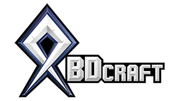

<!-- Made using the Best-README-Template -->

<!-- PROJECT LOGO -->
 

  

  <h3 align="center">BDCraft Patch Guides</h3>

  

    Here you'll find all the resources you need to create patches for Minecraft mods in the BDCraft style so that all of your textures will look great and cohesive! In this repository you'll find guides, FAQs, and sample files.
  

<!-- TABLE OF CONTENTS -->

  
<h2 style="display: inline-block">Table of Contents</h2>

  <ol>
    <li><a href="#guides">Guides</a></li>
    <li><a href="#about-bdcraft">About BDCraft</a></li>
    <li>
      <a href="#rules-terms-and-license">Rules, Terms, and License</a>
      <ul>
        <li><a href="#terms">Terms of Use for Resource Packs</a></li>
        <li><a href="#terms">Terms and Conditions of BDCraft</a></li>
      </ul>
    </li>
    <li><a href="#submitting-patches">Submitting Patches</a></li>
    <li><a href="#faq">FAQs</a></li>
    <li><a href="#contact">Contact</a></li>
    <li><a href="#acknowledgements">Acknowledgements</a></li>
  </ol>

<!-- GUIDES -->
## Guides
This repository is a work in progress.
We are busy working on visual style guides to help assist in the patch-making process.

[PureBDCraft Item Style Guidelines](./guides/styleguide_pure_items.png)

In the future we look forward to looking into creating video tutorials as well.

<!-- ABOUT -->
## About BDCraft

For about a decade now, [Sphax](https://twitter.com/sphax84) has been creating the [BDCraft](https://bdcraft.net) family of unique and high quality resource packs for Minecraft. BDCraft's flagship pack, [PureBDCraft](https://bdcraft.net/downloads/purebdcraft-minecraft/), turns Minecraft into a vibrant, comic book style world, with new interpretations of mobs and items to fit the comic inspired style. [VanillaBDCraft](https://bdcraft.net/downloads/vanillabdcraft-minecraft/) uses the same styles as Pure, but stays true to the original colors and designs found in Minecraft's default resource pack. [GrungeBDCraft](https://bdcraft.net/downloads/grungebdcraft-minecraft/) gives Pure's vibrant world a grungy, semi-realistic twist. Where PureBDcraft is cartoony, clean, and smooth, GrungeBDcraft is semi-realistic, noisy, and dirty.

All of these packs are available for download for use in Minecraft Java edition [here](https://bdcraft.net/downloads/). Our packs are also available for Minecraft Bedrock through the official Minecraft Marketplace!

We also make skin packs, addons, and have a pretty awesome forum--all of which can be found on [BDCraft.net](https://bdcraft.net).

<!-- GETTING STARTED -->
## Rules, Terms, and License
According to our terms, you are not authorized to create derivative works based on the PureBDcraft texturepack.

:bangbang:***HOWEVER***:bangbang:, we waive this condition of use exclusively for MODs support patches if, and only if, the conditions in **[this forum post](https://bdcraft.net/community/viewtopic.php?t=312)** are met. Please read the entire post carefully before creating any mods or patches.

:warning:*Remember*:warning:, when using other people's patches/textures/resources, they reserve all rights to those files. It's generally accepted that they allow reuse and rehosting of such resources as part of the community spirit. Always check each individual license and terms before modifying or distributing anyone else's work.

### Terms
Before downloading or creating your own assets, make sure you read the [Terms of Use](./TermsOfUse.txt) and agree to BDCraft's [Terms and Conditions](https://bdcraft.net/terms-and-conditions/).

<!-- Submission Guidelines -->
## Submitting Patches
The current process for submitting patches for mods is outlined **[here](https://bdcraft.net/community/viewtopic.php?t=312)**. Please read through carefully before submitting.
This process is being updated and new guidelines will be posted when they are available.

<!-- FAQ -->
## FAQ
Under construction.

<!-- CONTACT -->
## Contact
Come visit us!
Find us online at [BDCraft.net](https://bdcraft.net).
If you have any specific questions, feel free to [email us](mailto:contact@bdcraft.net), make a post on the [forum](https://bdcraft.net/community/), or drop us a line on [Discord](https://bdcraft.net/discord).

Want updates on the latest news and creations of BDCraft? Follow us on Twitter [@BDCraft_](https://twitter.com/BDCraft_)!
 
Want updates on specific BDCraft resource packs? We've got Twitter accounts for each!
* [@PureBDCraft](https://twitter.com/PureBDcraft)
* [@VanillaBDCraft](https://twitter.com/VanillaBDcraft)
* [@GrungeBDCraft](https://twitter.com/GrungeBDcraft)

You can also check us out on [Facebook](https://www.facebook.com/bdcraft/) and [YouTube](https://www.youtube.com/user/Sphax84) for more BDCraft content.

<!-- ACKNOWLEDGEMENTS -->
## Acknowledgements

* [Sphax](https://twitter.com/sphax84), creator of BDCraft.
* [HanFox](https://twitter.com/HanPrower), fearless admin and web dev.
* [StickerMonster](https://twitter.com/heylisten), artist who wants more people to make cool stuff.
